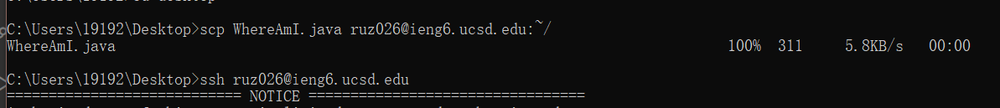
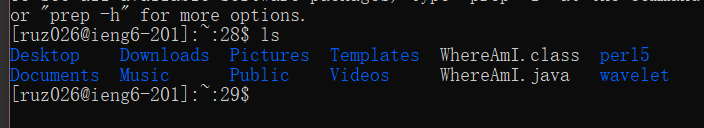

# Week 1 Lab Report
---
## Installing VSCode
First we should install the Visual Studio Code(VSCode) on our computer on run it with the following link: 

[VSCode Website](https://code.visualstudio.com/)

Here is an example of successfully installing: 

---
## Remote Connection And Logging in
Then we can start to do the remote connection to the school's computer with `ssh` command

`ssh` + our class user name and then + @ieng6.ucsd.edu can be the command to connect to a remote host

---
## Trying Some Commands
Then we can try some command on the remote computer such as `cd` and `ls`

`cd` command can help you to go into specifix locations on your computer or remote server. Just type the absolute path or relative path after `cd`. 

`ls` command can help you to see what files do you have in your current directory. Type `ls` and it will show all the names of the file you have in the place you are at. 

---
## Moving Files With scp Command
Then we can move files with `scp` command and run it on the remote computer

`scp` command moves file from your current directory to the directory you typed in. Type the file name and the path and `:~/` after scp will move the exact file to the exact directory you typed in. 

And here is the result of scp. 

We can see that WhereAmI.java it here in my remote server. 

---
## Setting SSH Key To Avoid Using Password
Then we can set a SSH key so that when we log into our account next time, we do not need to type the password again and again

First use the command `ssh-keygen`

Then it will give you feedback `Enter file in which to save the key`, and we can just press ENTER to specify the default path

Then it will create two files on our computer to save our key: the private key in `id_rsa` and the public key in `id_rsa.pub`

And then we need to copy the public key(not the private key) to our remote server with scp `command`. We first need to go to our server and type the following command: `mkdir .ssh`, and then log out and come back to our own computer. And then use `scp`

`scp /Users/<path>/.ssh/id_rsa.pub <username>@ieng6.ucsd.edu:~/.ssh/authorized_keys`

And now we can use `ssh` and `scp` from this computer to the server without typing password again and agian

---
## Optimizing Remote Running
Finally, we can use some tips to make the remote running easier and more pleasant

For example, We can first type the usual command code to run the file, then make some changes to the file. And then we can use the up arrow key to copy the changed file and run the new file. 

