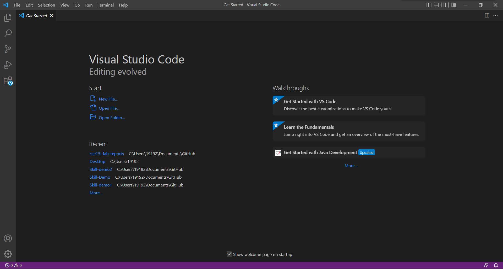
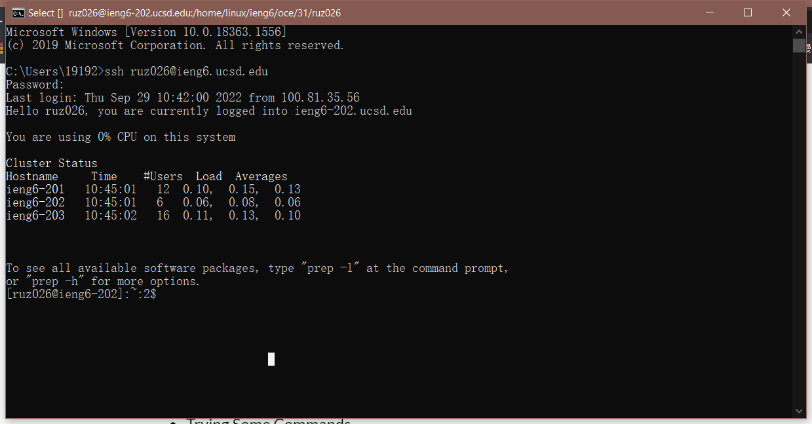
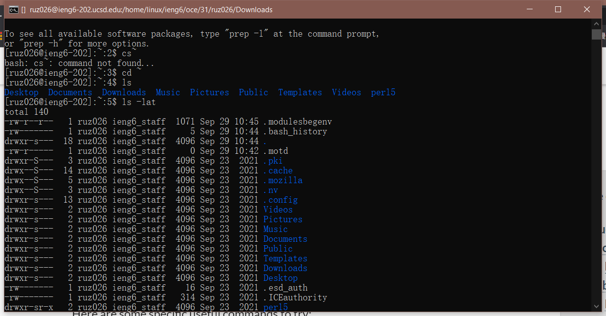
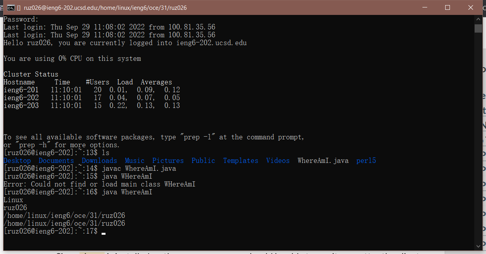
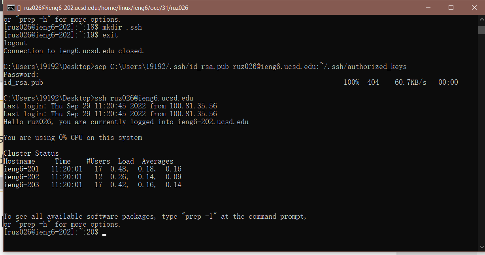
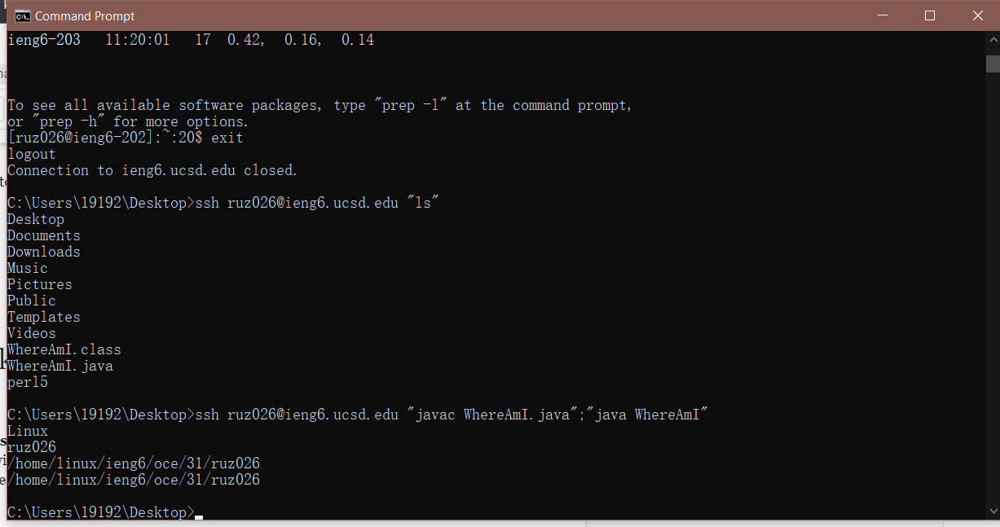

# Week 1 Lab Report
---
First we should install the Visual Studio Code(VSCode) on our computer on run it with the following link: 
[VSCode Website](https://code.visualstudio.com/)
Here is an example of successfully installing: 

---
Then we can start to do the remote connection to the school's computer with `ssh` command

---
Then we can try some command on the remote computer such as `cd` and `ls`

---
Then we can move files with `scp` command and run it on the remote computer

---
Then we can set a SSH key so that when we log into our account next time, we do not need to type the password again and again

---
Finally, we can use some tips to make the remote running easier and more pleasant
For example, We can first type the usual command code to run the file, then make some changes to the file. And then we can use the up arrow key to copy the changed file and run the new file. 
