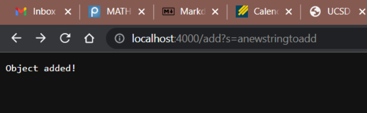
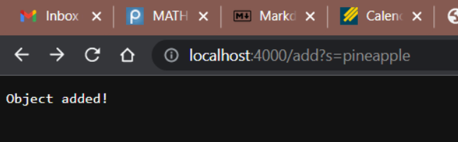
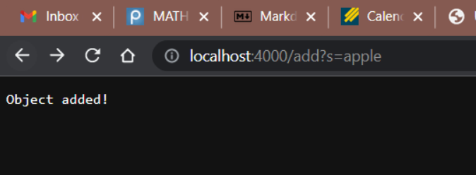
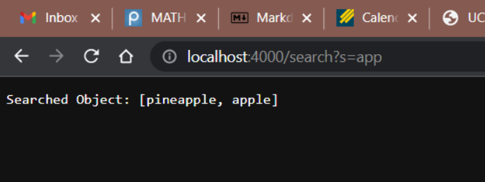
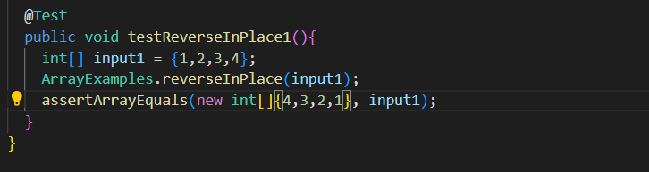
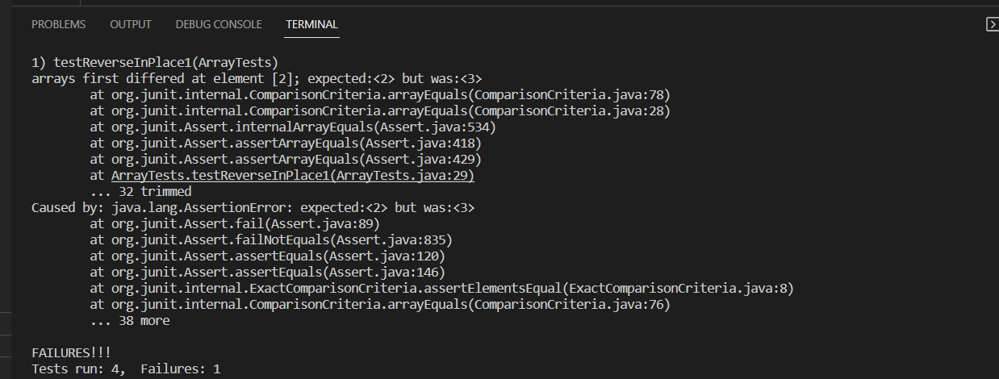
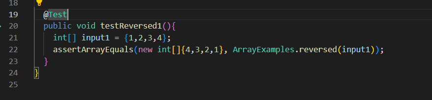
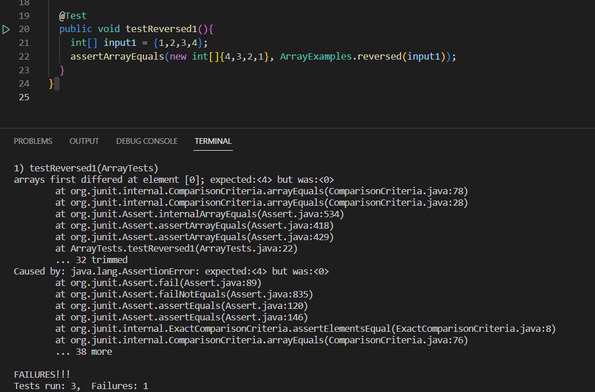

# Week 3 Lab Report
---
## Part 1
Here is my code for Simplest Search Engine from Week 2

```
# code block
import java.io.IOException;
import java.net.URI;
import java.util.ArrayList;
import java.util.List;

class Handler implements URLHandler {
    List<String> SearchList = new ArrayList<String>();
    List<String> ReturnList = new ArrayList<String>();

    public String handleRequest(URI url) {
        if (url.getPath().equals("/")) {
            return String.format("Start Searching");
        } else if (url.getPath().equals("/add")) {
            String[] parameters = url.getQuery().split("=");
            if (parameters[0].equals("s")) {
                SearchList.add(parameters[1]);
                return String.format("Object added!");
            }
        } else if(url.getPath().equals("/search")){
            String[] parameters = url.getQuery().split("=");
            if (parameters[0].equals("s")) {
                for(int i = 0; i < SearchList.size(); i++){
                    if(SearchList.get(i).contains(parameters[1])){
                        ReturnList.add(SearchList.get(i));
                    }
                }
                return String.format("Searched Object: " + ReturnList);
            } 
        }
        return "404 Not Found!";
    }
}

public class SearchEngine {
    public static void main(String[] args) throws IOException {
        if(args.length == 0){
            System.out.println("Missing port number! Try any number between 1024 to 49151");
            return;
        }

        int port = Integer.parseInt(args[0]);

        Server.start(port, new Handler());
    }
}
```

Here are my screenshots. 



In this screenshot, an object "anewstringtoadd" is added to the SearchList. In `handleRequest`, in the first if statement, `if (url.getPath().equals("/"))` is false, so it goes to the next one: `else if (url.getPath().equals("/add"))`, which is true here. And then `url.getQuery().split("=")` split the part after "add" into 2 parts and store them in `String[] parameters`, which becomes `[s, anewstringtoadd]`. And once we check that the first part is "s" by `if (parameters[0].equals("s"))`, which is true, we will add the second part to the SearchList by `SearchList.add(parameters[1]);` and return the String `return String.format("Object added!")`. And the SearchList now becomes `[anewstringtoadd]`. 



In this screenshot, an object "pineapple" is added to the SearchList. This is similar to the fist screenshot, except when `url.getQuery().split("=")` split the part after "add" into 2 parts and store them in `String[] parameters`, it is `[s, pineapple]`. After this, everything is same as the first screenshot, and the SearchList becomes `[anewstringtoadd, pineapple]` now. 



In this screenshot, an object "apple" is added to the SearchList. This is similar to the fist screenshot, except when `url.getQuery().split("=")` split the part after "add" into 2 parts and store them in `String[] parameters`, it is `[s, apple]`. After this, everything is same as the first screenshot, and the SearchList becomes `[anewstringtoadd, pineapple, apple]` now. 



In this screenshot, we want to search for the objects that contains "app". In `handleRequest`, in the first if statement, `if (url.getPath().equals("/"))` is false, so it goes to the next one: `else if (url.getPath().equals("/add"))`, which is also false here, so it goes to the next one: `else if(url.getPath().equals("/search"))`, which is true here. And then `url.getQuery().split("=")` split the part after "search" into 2 parts and store them in `String[] parameters`, which becomes `[s, app]`. And once we check that the first part is "s" by `if (parameters[0].equals("s"))`, which is true, we will go through the for loop `for(int i = 0; i < SearchList.size(); i++)` to start searching. Inside the for loop, we check if the object is the one we want by `if(SearchList.get(i).contains(parameters[1]))`, here the `parameters[1]` is "app". If the object contains "app", then we will add the object to the ReturnList by `ReturnList.add(SearchList.get(i))`. And after the for loop goes through the SearchList, it will return the ReturnList, which is the list of objects that contains "app" with `return String.format("Searched Object: " + ReturnList)`. 

Inside the for loop, it checks for every element in the SearchList, whcih is `[anewstringtoadd, pineapple, apple]`. 

For `anewstringtoadd`, `if(SearchList.get(i).contains(parameters[1]))` is false, so it is not added to the ReturnList, the ReturnList does not change. 

For `pineapple`, `if(SearchList.get(i).contains(parameters[1]))` is true, so it is added to the ReturnList, the ReturnList changes to `[pineapple]`. 

For `apple`, `if(SearchList.get(i).contains(parameters[1]))` is true, so it is added to the ReturnList, the ReturnList changes to `[pineapple, apple]`. 

---
## Part 2
__Bug1: Bug in method "reverseInPlace" in ArrayExamples__

The Failure Inducing Input: 
```
# code block
  @Test
  public void testReverseInPlace1(){
    int[] input1 = {1,2,3,4};
    ArrayExamples.reverseInPlace(input1);
    assertArrayEquals(new int[]{4,3,2,1}, input1);
  }
```


The Symptom:



The Bug:


The line `arr[i] = arr[arr.length - i - 1]` changes the ith element, but it does not save the ith element, so when we need to change the later element, the correct value is not stored. The symptom is that the `arr[2]` should be 2 but is 3. Our input is `{1,2,3,4}`. 

When we go through the for loop

i = 0, arr.length - i - 1 = 4 - 0 - 1 = 3, so `arr[0] = arr[3] = 4`, so the array now becomes `{4,2,3,4}`.
i = 1, arr.length - i - 1 = 4 - 1 - 1 = 2, so `arr[1] = arr[2] = 3`, so the array now becomes `{4,3,3,4}`.
i = 2, arr.length - i - 1 = 4 - 2 - 1 = 1, so `arr[2] = arr[1]`, since we did not store `arr[1] = 2`, arr[1] has been changed to 3, so `arr[2] = arr[1] = 3`, and the array now becomes `{4,3,3,4}`.
i = 3, arr.length - i - 1 = 4 - 3 - 1 = 0, so `arr[3] = arr[0]`, since we did not store `arr[0] = 1`, arr[0] has been changed to 4, so `arr[3] = arr[0] = 4`, and the array now becomes `{4,3,3,4}`.

So our final output is `{4,3,3,4}`, which is exactly the symptom. 

To solve the bug, we need to make some changes to the for loop: 
```
# code block
  for(int i = 0; i < arr.length/2; i += 1) {
      int temp = arr[i];
      arr[i] = arr[arr.length - i - 1];
      arr[arr.length - i - 1] = temp;
    }
```


---
__Bug2: Bug in method "reversed" in ArrayExamples__

The Failure Inducing Input:
```
# code block
  @Test
  public void testReversed1(){
    int[] input1 = {1,2,3,4};
    assertArrayEquals(new int[]{4,3,2,1}, ArrayExamples.reversed(input1));
  }
```


The Symptom:



The Bug:


The line `arr[i] = newArray[arr.length - i - 1]` is the bug line. newArray is an empty array that we created to store the reversed array with `int[] newArray = new int[arr.length];`, and the bug line sets the arr[i] to an element of an empty array, so the arr becomes `{0,0,0,0}` after the for loop, and that is the symptom show in the screenshot: `arr[0]` should be 4 but is 0. 

To solve the bug, we just need to simply change `arr[i] = newArray[arr.length - i - 1]` to `newArray[i] = arr[arr.length - i - 1];` and return the newArray, not the arr: `return newArray;`. 