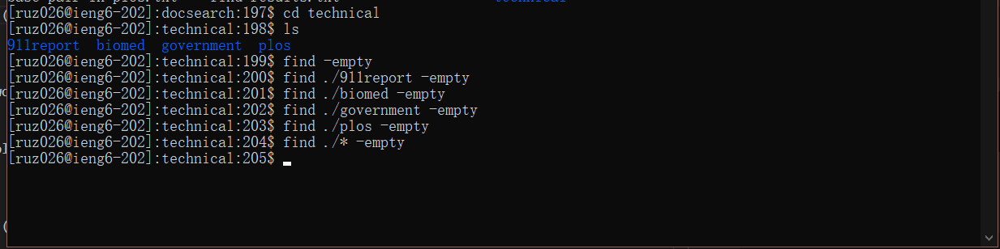

# Week 5 Lab Report
---

## command-line options for find
No.1 `find directory -empty`

This command will find the empty files and directories in the directory we put in, and if we just use `find -empty`, it will search under current directory

```
# code block
[ruz026@ieng6-202]:technical:198$ ls
911report  biomed  government  plos
[ruz026@ieng6-202]:technical:199$ find -empty
[ruz026@ieng6-202]:technical:200$ find ./911report -empty
[ruz026@ieng6-202]:technical:201$ find ./biomed -empty
[ruz026@ieng6-202]:technical:202$ find ./government -empty
[ruz026@ieng6-202]:technical:203$ find ./plos -empty
[ruz026@ieng6-202]:technical:204$ find ./* -empty
[ruz026@ieng6-202]:technical:205$
```



This means that there is no empty files or directories in the technical file. It is useful because when we are working with many files, empty files are usually usuless, so we want to find them out and ignore them. 

---

No.2 `find directory -name filename -exec rm -i {} \; `

This command will find the file that has the file name we put in (or multiple files if there are) and delete the file with comfirmation. And it will ask for confirmation before deleting. If we want to delete, type in Y for yes, if not, N for no. 

```
# code block
[ruz026@ieng6-202]:technical:208$ find -name *report.txt -exec rm -i {} \;
rm: remove regular file './government/About_LSC/Progress_report.txt'? n
rm: remove regular file './government/About_LSC/Strategic_report.txt'? N
rm: remove regular file './government/About_LSC/commission_report.txt'? n
[ruz026@ieng6-202]:technical:209$
```


I type no because this is just a show of command and I don't actually want to delete these files. It is useful because sometimes we want to delete some files that we know what they are but we don't know where they are, or we want to delete multiple files that contains same character in their names, and this command can be used. 

---

No.3 `find . -atime +n`

This command will find all the files under current directory that was last accessed more than n days ago. We can change `+` to `-` for less than n days ago. We can also change the `.` part to any directory as we want, or use this `atime` command with other commands together to fulfill our needs. Moreover, `atime` stands for days, and `amin` stands for minutes. 

```
# code block
[ruz026@ieng6-202]:technical:221$ find . -amin -5
[ruz026@ieng6-202]:technical:222$ find . -atime -2
.
./911report
./biomed
./government
./government/About_LSC
./government/Alcohol_Problems
./government/Env_Prot_Agen
./government/Gen_Account_Office
./government/Media
./government/Post_Rate_Comm
./plos
```


This means that no file has been accessed in less than 5 minutes, and those files shown were accessed in less than 2 days. This command is useful when we are working in a long time period and want to find files by time. 

---


## command-line options for less
No.1 `less -p "string" filename`

This command will start to read the file "filename" at first occurrence of pattern "string" in the file. 

```
# code block
[ruz026@ieng6-202]:technical:247$ less -p "security" 911report/chapter-1.txt
[ruz026@ieng6-202]:technical:248$
```


This command helps when we want to briefly read some files and there are something specificly we care about, and we can read from that point. 

---

No.2 `less -N filename`

This command will show the line number of the file as we read through. 

```
# code block
[ruz026@ieng6-202]:technical:245$ less -N 911report/chapter-1.txt
[ruz026@ieng6-202]:technical:246$ [ruz026@ieng6-202]:technical:246$
```


By showing the line number, we can have a trace of where we are at the file and can make the file more clearly structured. The number gives us a feel of orginazed among all the words. 

---

No.3 `less -f filename`

This command will force non-regular files to be opened, such as directories, device special file and so on. Since by default, less command will refuse to open non-regular files. 

```
# code block
[ruz026@ieng6-202]:technical:249$ less -f 911report
[ruz026@ieng6-202]:technical:250$ [ruz026@ieng6-202]:technical:250$
```


So here I open the directory 911report with less command, and it displays all files in 911report file in a new screen, which can be exit with `q`. This command is useful when we want to open some files that usual less command cannot open, not restricted to directory, for example, some device special files. 

---


## command-line options for grep
No.1 `grep "A.*B" filename`

This command will search for any pattern that starts with "A" and ends with "B" with anything in-between. And filename can be replaced with directory or multiple files by file pattern. 

```
# code block
[ruz026@ieng6-202]:technical:252$ grep "When.*Boston" 911report/chapter-1.txt
    When he checked in for his flight to Boston, Atta was selected by a computerized prescreening system known as CAPPS (Computer Assisted Passenger Prescreening System), created to identify passengers who should be subject to special security measures. Under security rules in place at the time, the only consequence of Atta's selection by CAPPS was that his checked bags were held off the plane until it was confirmed that he had boarded the aircraft. This did not hinder Atta's plans.
[ruz026@ieng6-202]:technical:253$
```


Here I search for any sentence that starts with "When" and ends with "Boston". This command is useful when we are searching through a file with multiple characteristic we want it to have, rather than search by one word. 

---

No.2 `grep -iw "string" filename`

This command will search for the exact word "string" in the file. It will not show words that contain "string". For example, if we search for "a" with this command, it will show only "a"s, but not any word that contains character "a". 

```
# code block
[ruz026@ieng6-202]:technical:253$ grep -iw "be" 911report/chapter-2.txt
                instance, omitting the article "al" that would be part of their name in their own
                for the Muslim community, or Ummah, arose. Initially, his successors could be drawn
                who became the Shia held that any leader of the Ummah must be a direct descendant of
                Muslims, a good government would be one guided by the moral principles of their
                abolition of a secular state. It does mean that some Muslims tend to be
                legislation, only prove these rulers to be false Muslims usurping God's authority
                oppression and humiliation cannot be demolished except in a rain of bullets." For those yearning for a lost sense of order in an older,
                of mankind." If the United States did not comply, it would be at war with the
                appeared to be ungainly but was in fact quite athletic, skilled as a horseman,
                financial support network that came to be known as the "Golden Chain," put together
                agreed that the organization successfully created for Afghanistan should not be
                sons. The killers were assumed to be rival Egyptians. The outcome left Bin Ladin
                coalition. After the Saudis agreed to allow U.S. armed forces to be based in the
                would be misleading to apply the label "al Qaeda operations" too often in these
                early years. Yet it would also be misleading to ignore the significance of these
                the cylinder, then discovered it to be bogus.
                insurmountable barrier to cooperation in terrorist operations. As will be described
                1995 appears to have been a tipping point. The would-be killers, who came from the
                been and continues to be preoccupied with its rivalry with India, especially over
            For a time, it may not have been clear to Bin Ladin that the Taliban would be his
            Though Bin Ladin had promised Taliban leaders that he would be circumspect, he broke
                situate him where he might be easier to control.
            The inner core of al Qaeda continued to be a hierarchical top-down group with defined
                committee chief, continued to be the operational commander of the cell; but because
                embassy in Nairobi was an easy target because a car bomb could be parked close by,
                that "when it becomes apparent that it would be impossible to repel these Americans
                history be a witness that I am a criminal."
[ruz026@ieng6-202]:technical:254$
```


So it shows all the "be" word in the file chapter-2.txt, rather than all words that contains "be". This is really useful for searching since many short words are part of other longer words, and when we search for those shorter words, the longer words can always mix with the actual result we want. 

---

No.3 `grep -A/-B/-C N "String" filename`

This command can be separated into 3 commands. 

`grep -A N "String" filename` shows N lines after the match with "string" in this file. 

`grep -B N "String" filename` shows N lines before the match with "string" in this file. 

`grep -C N "String" filename` shows N lines both before after the match with "string" in this file. 

```
# code block
[ruz026@ieng6-202]:technical:260$ grep -A 2 "Omari" 911report/chapter-1.txt
```


Here is the example I only use -A to search for that person's name, but -B and -C works the same. And command such as `-i` `-iw` can be used together with this command. This is useful when we need more than only the word we search for, as we try to understand what is around it. 