# Week 7 Lab Report
---

## Part 1
Our group picks the challenge one: 

In TestDocSearch.java, copy the test called testSearchCount, rename the new test to testSearchCount2 and change the query string being tested to tax rather than taxation. 

The shortest sequence of vim command is: 

```
25j
<Shift>+V
5j
y
5j
p
j
3e
A 2 
<esc>
2j
6w
dw
i
tax
<esc>
:wq + <enter>
```

---

Screen Shots:
```
25j
```
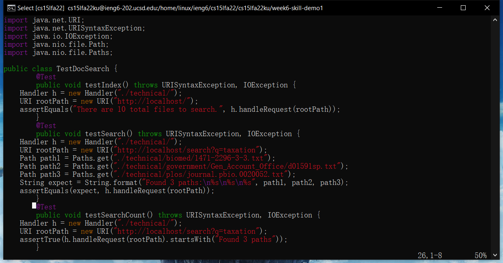

```
<Shift>+V
```
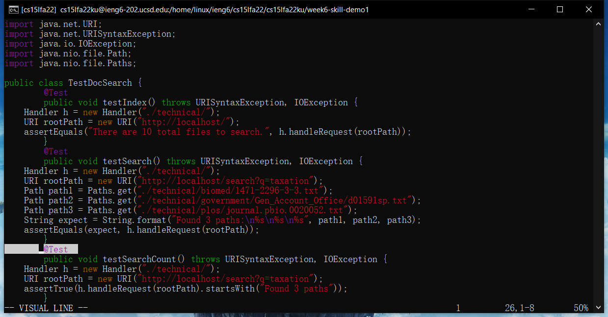

```
5j
```
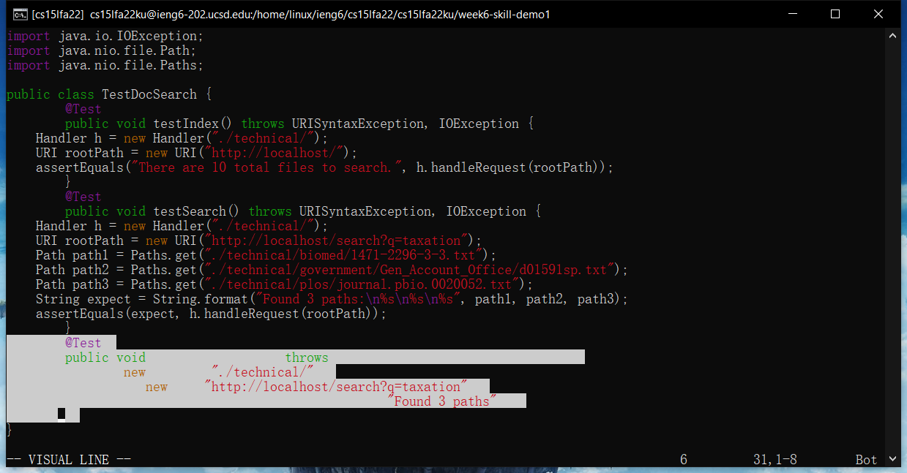

```
y
```


```
5j
```
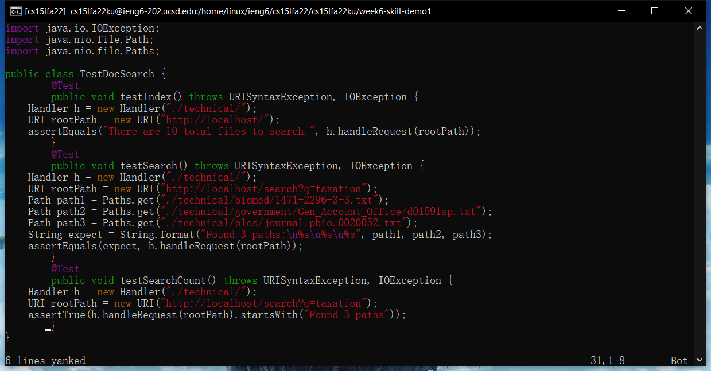

```
p
```
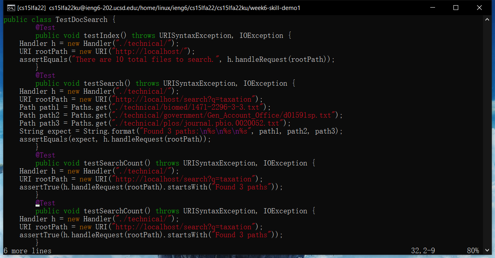

```
j
```
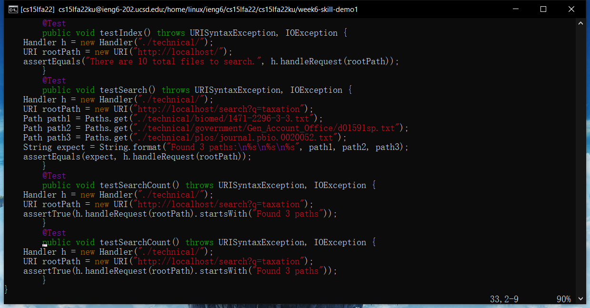

```
3e
```


```
a2
```
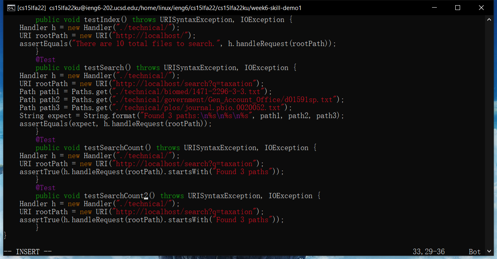

```
<esc>
```
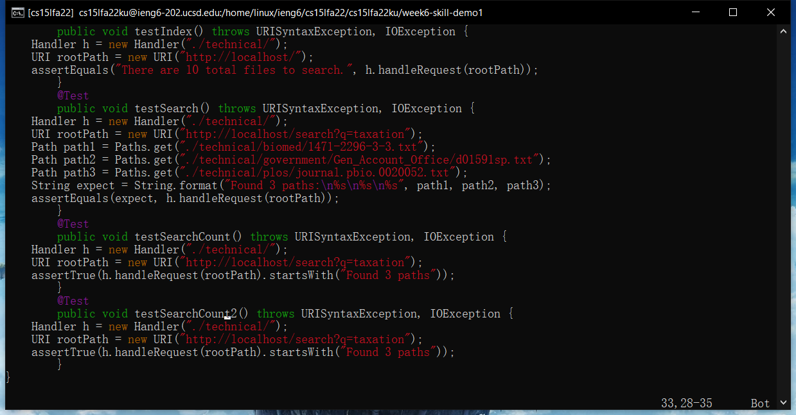

```
2j
```


```
6w
```


```
dw
```


```
i
```
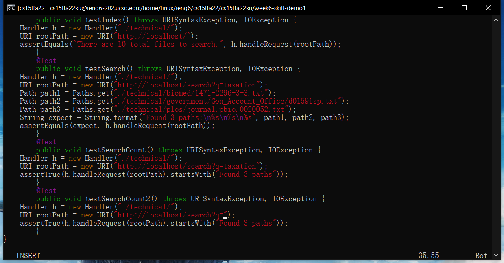

```
tax
```


```
<esc>
```
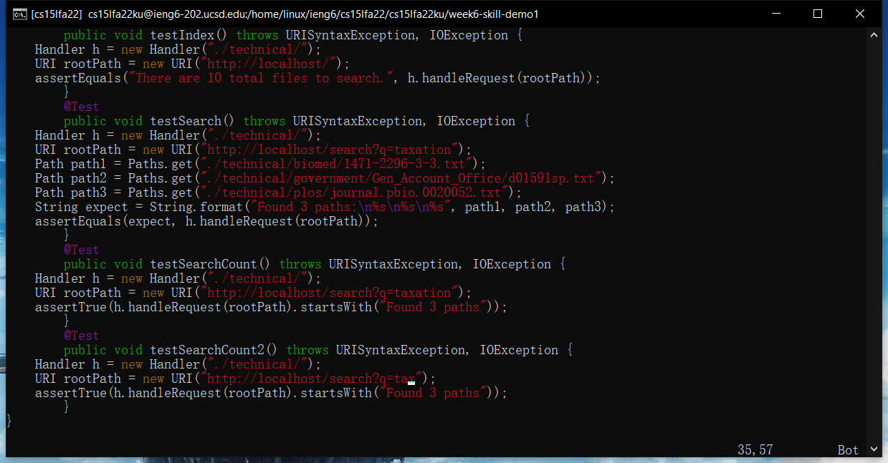

```
:wq + <enter>
```
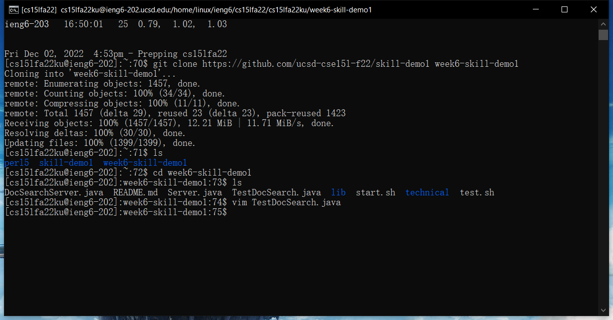


---

## Part 2
Start with VSCode and scp: 2min 51s
Start in remote with vim: 1min 56s

I would prefer the second way because this will reduce the time that I need to copy the file from remote to local and copy back to remote after changing it if I don't have the file on my computer. 

One important factor that will influence my decision is the workload. If there are just a few changes I need to make to the code, doing it remotely is definitely my first choice. However, if there are lots of work to do, I would rather copy them to local and do it with VSCode, since it is much easier for me to write code with VSCode, and this can save me planty of time when there are lots of work to do. 